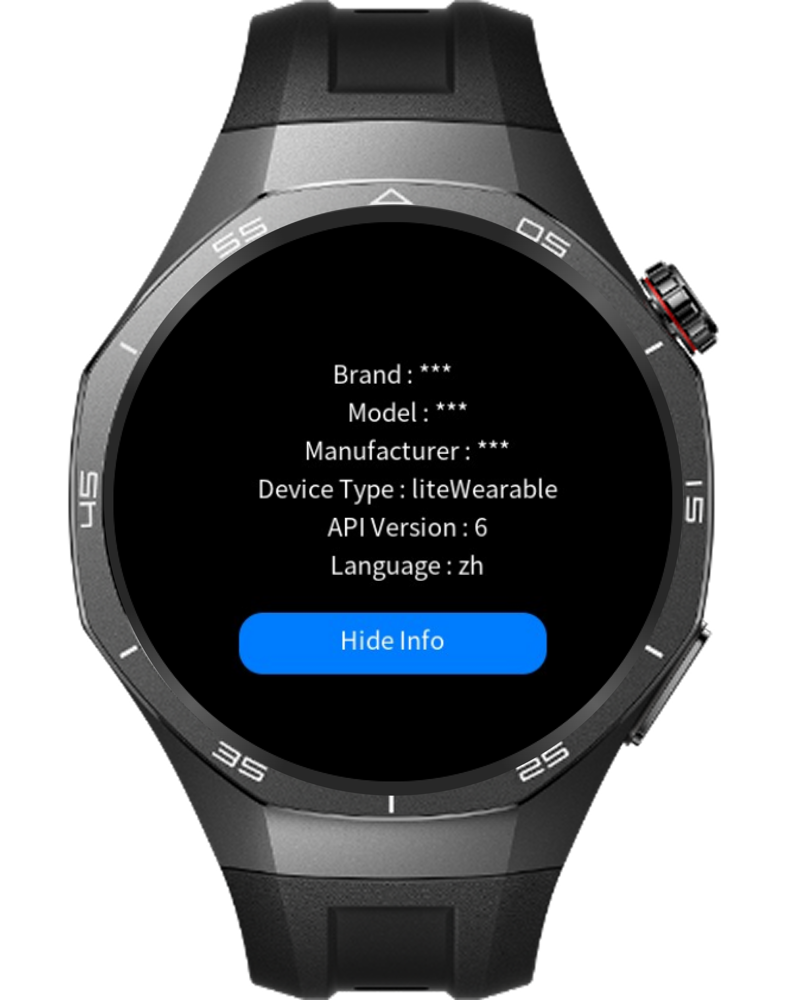

> **Note:** To access all shared projects, get information about environment setup, and view other guides, please visit [Explore-In-HMOS-Wearable Index](https://github.com/Explore-In-HMOS-Wearable/hmos-index).

# How to Get Device Information By Using @system.device

This application demonstrates how to develop the functionality that can check the device information

# Preview

<div>
  
  
</div>

# Use Cases

1. Users can start the application and see or hide the current information by using about device button

# Technology

## Stack

- **Languages**: ArkTS, ArkUI
- **Frameworks**: HarmonyOS 5.1.0(18)
- **Tools**: DevEco Studio Vers 5.1.0.828SP1,
- **Libraries**: @system.device

## Required Permissions

- No Permission Required


# Directory Structure

```
│   config.json
│   
├───js
│   └───MainAbility
│       │   app.js
│       │
│       ├───i18n
│       │       en-US.json
│       │       zh-CN.json
│       │
│       └───pages
│           └───index
│                   index.css
│                   index.hml
│                   index.js
│
└───resources
    ├───base
    │   ├───element
    │   │       string.json
    │   │
    │   └───media
    │           icon.png
    │           icon_small.png
    │
    └───rawfile

```

# Constraints and Restrictions

## Suported Devices

- Huawei Sport (Lite) Watch GT 4/5/6
- Huawei Sport (Lite) GT4/5 Pro
- Huawei Sport (Lite) Fit 3/4
- Huawei Sport (Lite) D2
- Huawei Sport (Lite) Ultimate
- 
## Limitations

- Application needs to be launch on real devices to use real device information

# License

The Application is distributed under the terms of the MIT License.
See the [LICENSE](./LICENSE) for more information.


